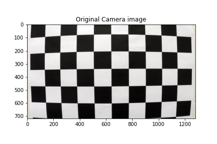
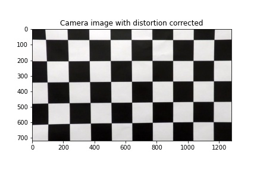
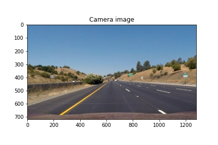
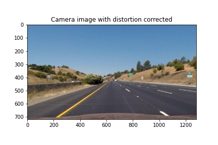
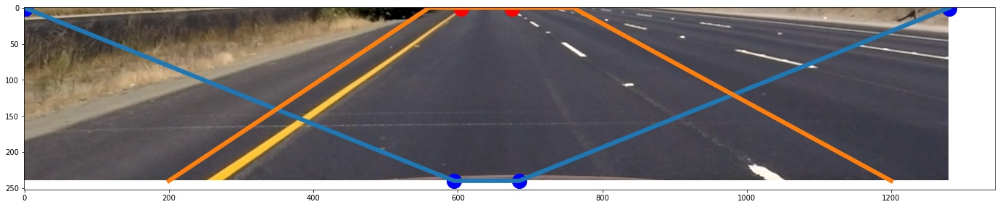
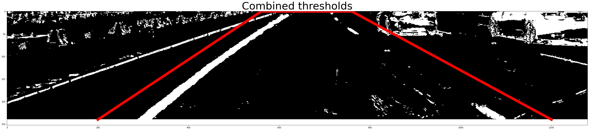
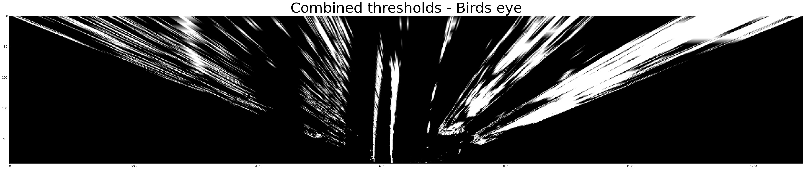
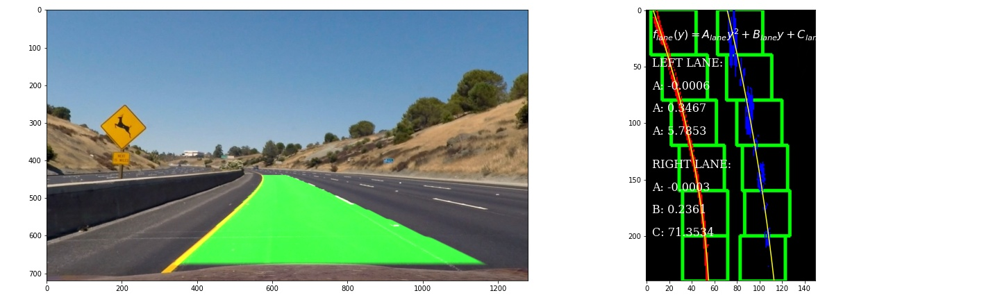

## Udacity - Self-Driving Car Engineer NanoDegree

## Advanced Lane Finding by Cristian Alberch - Jan 2021

### Overview

When we drive, we use our eyes to decide where to go. The lines on the road that show us where the lanes are act as our constant reference for where to steer the vehicle. 

This project is will detect lane lines in video images using Python and OpenCV without the use of machine learning techniques and produce an output video showing the lane area. 


The pipeline used to produce the output video is summarised. Only highlights are shown in this report. The full code for each item number below is included in the Jupyter Notebook using the same section number references.

#### 1. Camera Calibration: 
The output image from the camera has some distortion due to the camera lens. In order to accurately measure distances in a picture, it is necessary to remove the camera distortion.

A set of sample checkerboard images are used to calculate the correct image object points that are used by CV2 calibrateCamera function to produce a distortion free image. 

  |  

Although it is less obvious, the below image is also distorted:



Applying the camera calibration using function,
```
def cal_undistort(img, objpoints, imgpoints):
    gray = cv2.cvtColor(img,cv2.COLOR_BGR2GRAY)
    ret, mtx, dist, rvecs, tvecs = cv2.calibrateCamera(objpoints, imgpoints, gray.shape[::-1], None, None)
    undist = cv2.undistort(img, mtx, dist, None, mtx)
    return undist
```

yields the same image undistorted.




#### 2. Horizontal Image Crop: 
The road image of interest is cropped horizontally to display the road area only.



The red lines indicate the region of interest for road markings.

The end of the road markings to identify are shown as the two red dots. In a 2D bird's eye view image the distance between the two blue dots and the two red dots is the same.


#### 3. Sobel Operators: 

Sobel operators are applied to transform the image from color to black & white with emphasis on road lane features. The Sobel operators applied include magnitude, direction (x & y axis), and gradient. The image is then processed to identify lane markings according to Hue-Saturation-Level.

```
def threshold_binary(img):
    gradx = abs_sobel_thresh(img, orient='x', sobel_kernel=5, thresh=(30, 180))
    grady = abs_sobel_thresh(img, orient='y', sobel_kernel=5, thresh=(50, 160))
    mag_binary = mag_thresh(img, sobel_kernel=7, mag_thresh=(50, 160))
    dir_binary = dir_threshold(img, sobel_kernel=15, thresh=(0.8, 1.3))

...

    combined_thresh[((gradx == 1) & (grady == 1)) | ((mag_binary == 1) & (dir_binary == 1))] = 1
    combined_hls=hls_color(img, s_thresh=(100, 255), sx_thresh=(40, 80))/255

 ...

    combined_thresh_hls=np.clip(combined_thresh_hls, a_min = 0, a_max = 1)        
    return combined_thresh_hls
```
Applying the threshold function, results in an improved identification of lane markings.


#### 4. Region of Interest: 
The filtered image is cropped to select only the region of interest as indicated in the red lines.




#### 5. Perspective Transform: 

The image containing the region of interes is transformed to a 2D bird's eye view. As per Para 2, a perspective transform is applied to the image using the start points and end points (red dots and red dots in Para. 2) as references. 

```
def warp(img_roi):
    src = np.float32([[0, 240], [1280, 240], [0, 0], [1280, 0]])
    dst = np.float32([[595, 240], [685, 240], [0, 0], [1280, 0]])
    M = cv2.getPerspectiveTransform(src, dst)
    img_warped = cv2.warpPerspective(img_roi, M, (1280, 240))
    return img_warped
```



#### 6. Perspective Lane Selection: 
The birds eye view is subsequently cropped to reduce the size of the image for lane identification.

#### 7. Polynomial Regression Estimate: 
The pixels in the lane identification are passed to find_lane_pixels function which provides an estimate of the pixels located on the left and right side. This is done by first passing the matrix image to a histogram calculation. The histogram peaks determine where the most pixels are located, and thereby where the lane markings are most likely to occur. The calculation is carried out iteratively through a number of windows.

```
def find_lane_pixels(binary_warped):
    # Take a histogram of the bottom half of the image
    histogram = np.sum(binary_warped[binary_warped.shape[0]//2:,:], axis=0)
    # Create an output image to draw on and visualize the result
    img_out = np.dstack((binary_warped, binary_warped, binary_warped))
    # Find the peak of the left and right halves of the histogram
    # These will be the starting point for the left and right lines
    midpoint = np.int(histogram.shape[0]//2)
    leftx_base = np.argmax(histogram[:midpoint])
    rightx_base = np.argmax(histogram[midpoint:]) + midpoint

    # HYPERPARAMETERS
    # Choose the number of sliding windows
    nwindows = 6
    # Set the width of the windows +/- margin
    margin = 20
    # Set minimum number of pixels found to recenter window
    minpix = 20

    ...

    return leftx, lefty, rightx, righty, img_out
```

A best-fit 2nd order polynomial regression is carried out on the pixels representing the left and right lanes respectively. curve modelling the lane curve.

```
def fit_polynomial(binary_warped):
    left_fit = np.polyfit(lefty, leftx, 2)
    right_fit = np.polyfit(righty, rightx, 2)

    ...

    return img_out, left_fit, right_fit, left_fitx, right_fitx, ploty
```

The function returns left_fit list containing [A,B,C] for 2nd degree polynomial function.

=A_{right}y^2+B_{right}y+C_{right})

This can then be plotted to show the pixels image, windows showing search area and polynomial curves.




#### 8. Regression Estimate Value Checks: 
The left and right lane curves are verified for congruence, considering that the distance between the lanes is constant. 

If the distance between the left and right lanes is too large or too small, this means that the lanes are either diverging or converging instead of being parallel. If this happens, the lane with a diverging value considering the previous ones is corrected with respect to the other lane.

```
def new_fit_check(lane,left_fit, right_fit, left_fitx, right_fitx):
    #check if lane detection is too large or too small
    if (np.mean(right_fit) - np.mean(left_fit)>24) or (np.mean(right_fit) - np.mean(left_fit)<10): #diverging too much
        #greater left lane variation
        if np.abs((np.mean(lane.left_fitx_smooth)-np.mean(left_fitx))) > np.abs((np.mean(lane.right_fitx_smooth)-np.mean(right_fitx))):
            left_fitx = right_fitx - 58
            left_fit[0] = right_fit[0]
        #greater right lane variation
        else:
            right_fitx = left_fitx + 58
            right_fit[0] = left_fit[0]
    return left_fit, right_fit, left_fitx, right_fitx
```
The values are further averaged over the previous 10 image frames to reduce jaggedness and ensure the predicted path is consistent with the previous images.


#### 9. Radius of Curvature: 
The curvature radius is calculated according to the estimated lane curve and 2nd order polynomial coefficients by entering A, B and C values calculated in Para. 7.


=\frac{(1+(2Ay+B)^2)^{3/2}}{|2A|})


Each dashed line measures 10 feet, and the empty spaces in-between measure 30 feet. So every time a car passes a new dashed line, the car has traveled 40 feet.

In Para. 2, the distance from the camera to the end of lane detection is approximately 120ft long and 12ft lane wide.

Real world:
length: 120ft
width: 12ft

Pixels: 240pixels
width: 90pixels

The bird's eye view lane representation is vertically compressed as the length/width ratio is 24/9 as opposed to 10/1 in the region of interest real-world representation.
The factors are corrected to reflect correct radius measurements.


#### 10. Image Overlay: 
An overlay fill is superimposed to the original image based on the lane curves identified.

```
def overlay_fill(img, left_fitx, right_fitx, ploty):
    ... 
    pts_left = np.array([np.transpose(np.vstack([left_fitx, ploty]))])
    pts_right = np.array([np.flipud(np.transpose(np.vstack([right_fitx, ploty])))])
    pts = np.hstack((pts_left.astype(int), pts_right.astype(int)))    
    #filling pixels inside the polygon defined by "vertices" with the fill color    
    cv2.fillPoly(mask, pts, ignore_mask_color)        
    #returning the image only where mask pixels are nonzero
    masked_img = cv2.bitwise_and(img_out, mask)
    return masked_img
```

#### 11. Text Overlay: 
The curvature radius value is overlayed to the image output.

```
def overlay_text(img, text_line1, text_line2, text_line3):
    ...

    font = cv2.FONT_HERSHEY_SIMPLEX   
    org1 = (1300, 400) 
    fontScale = 1
    color1 = (0, 0, 255) 
    thickness = 2
    masked_img = cv2.putText(img, text_line1, org1, font,  
                       fontScale, color1, thickness, cv2.LINE_AA)
    ...

    return masked_img
```


### Apply Inveserse Perspective Transform

In order to show the image overlay in perspective, an inverse transformation is applied to reflect the end result.
```
def warp_inverse(img_roi):
    #source points: the entire borders are selected
    src = np.float32([[0, 240], [1280, 240], [0, 0], [1280, 0]])
    #destination points: the vanishing point is inverted to be directed to viewer point
    dst = np.float32([[595, 240], [685, 240], [0, 0], [1280, 0]])
    Minv = cv2.getPerspectiveTransform(dst, src) # Inverse transformation
    img_warped_inv = cv2.warpPerspective(img_roi, Minv, (1280, 240)) # Image warping
    return img_warped_inv
```


## Results & Discussion

#### 1. Sobel Operators: 
Application of Sobel operators was shown to be effective and able to distinguish lanes in a wide variety of lighting and road conditions.

#### 2. Region of Interest: 

Region of interest vertices are static and were selected based on the expected vehicle visibility of lanes. As the vertices are fixed, this severly limits the range and accuracy of lane detection. The model could be improved by applying dynamic vertices. For example, if the car is steering to the right, the lane vanishing point is likely to be to the right in a highway (not necessarily in a very curvy local road).

#### 5. Perspective Transform: 
The image is warped to show a birds eye view. The perspective transform applied provides a high viewing angle (longer road measurements) and can be used to detect obstacles to the sides of the car.

This was found to be preferable than the project suggested method of applying a local bird's eye view to the lane section only, and is more scalable if the model is expanded to detect markings or objects near the lanes such as crash barriers, or fences using machine learning.


#### 8. Regression Estimate Value Checks: 
Smoothing against previous image frame values and checking the distance between left and right lanes provided an improved lane detection. This can be further improved by eliminating outliers (such as those found in shades) incongruent with the shape of lanes or rate of change found in lane directional changes.

